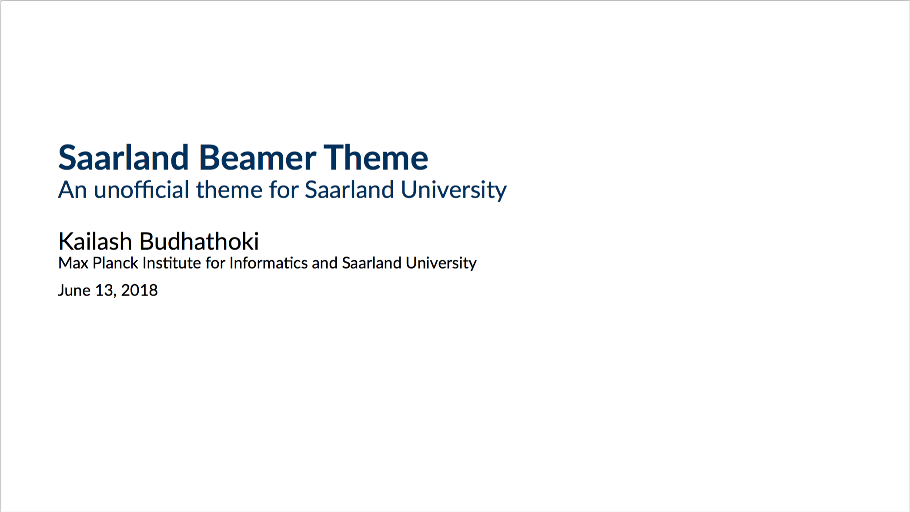
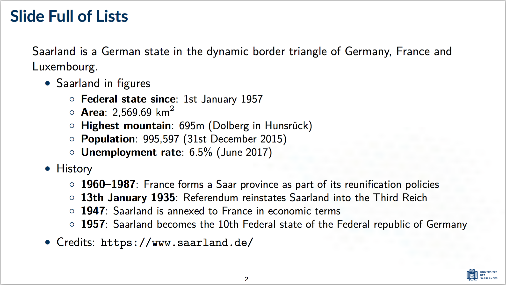
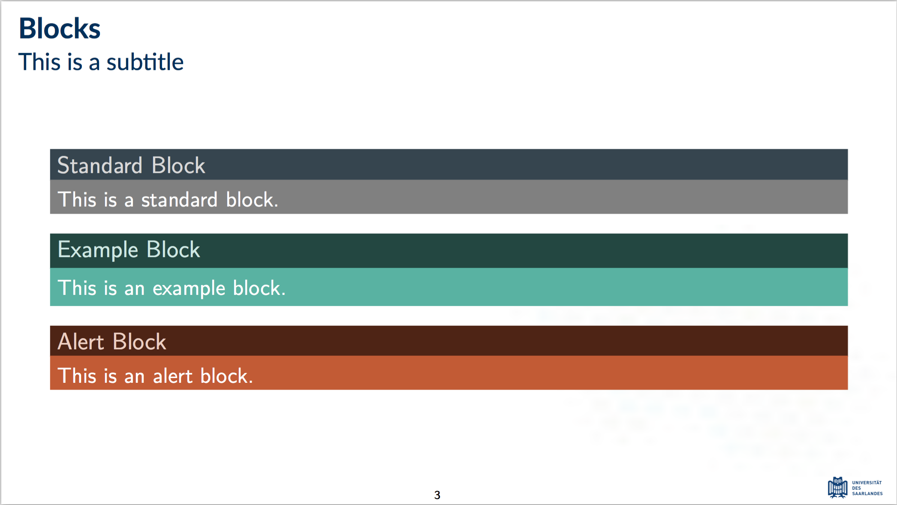

Saarland Beamer Theme
---------------------
This is an unofficial beamer theme based on the colours of [Saarland University][sic-link].

  
  
  

**IMPORTANT**: Install the [Lato font][lato-font-link], and compile using LuaLaTeX or XeLaTeX. 

If you have any questions or suggestions, feel free to write me at [kailash.buki@gmail.com](mailto:kailash.buki@gmail.com)`.

[sic-link]: https://saarland-informatics-campus.de/
[lato-font-link]: https://fonts.google.com/specimen/Lato
