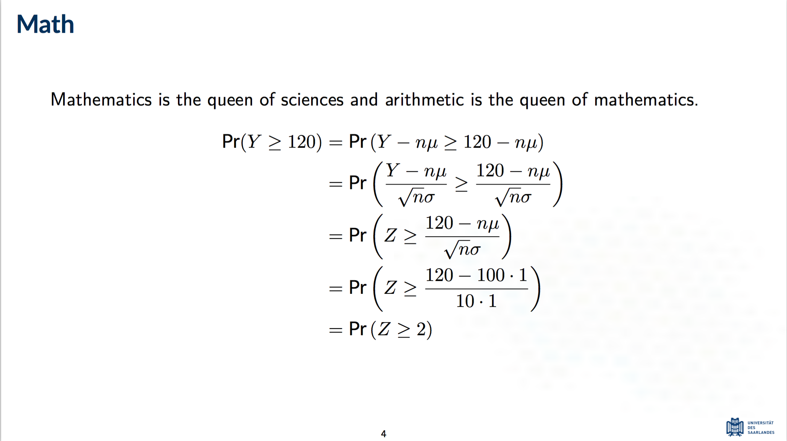

Saarland Beamer Theme
---------------------
This is an unofficial beamer theme based on the colours of [Saarland University][sic-link]. If you have any questions or suggestions, feel free to write me at [my email](mailto:kailash.buki@gmail.com).

**IMPORTANT**: Install the [Lato font][lato-font-link], and compile using LuaLaTeX or XeLaTeX. 

  
  
  
  

[sic-link]: https://saarland-informatics-campus.de/
[lato-font-link]: https://fonts.google.com/specimen/Lato
